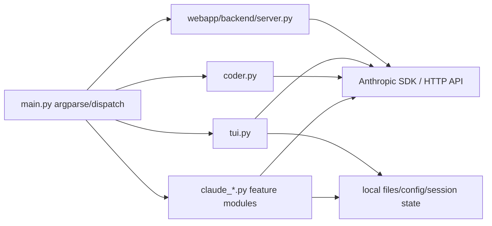
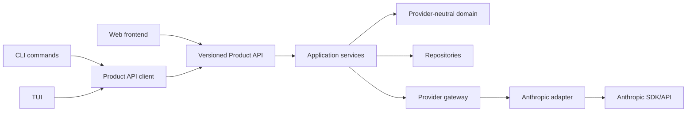

# Dependency Map

## Current runtime dependency graph



## Target dependency graph



## Boundary inventory

| Boundary | Current implementation | Risk | Required direction |
|---|---|---|---|
| CLI dispatch | Large conditional chain in `main.py` | High change coupling | Thin commands over one typed client |
| Request transport | Repeated SDK/HTTP usage | Inconsistent retries/errors | Canonical transport and retry policy |
| Provider types | Distributed across modules | Public contract leakage | Conversion only inside adapter |
| Credential loading | Client-facing environment/config | Secret exposure on clients | Server-only secret resolution |
| Streaming | Multiple representations | Terminal-state inconsistency | Canonical stream vocabulary |
| Filesystem/tools | Local execution paths | Path/shell policy risk | Default-deny grants and sandbox workers |
| Web backend | Local convenience server | Ambiguous trust boundary | Versioned Product API foundation |
| Persistence | Local/session-specific | No durable platform semantics | Repository interfaces and migrations |

## Import classification procedure

Run:

```bash
python scripts/repository_inventory.py --root . --output build/repository-inventory.json
```

Review:

- `provider_imports` for provider dependencies;
- `risk_hits.*.credential_reference` for credential reads;
- `cli.declared_not_directly_read` for compatibility aliases or dead flags;
- `cli.read_not_declared` for dynamic parser or wiring defects;
- `risk_hits` for shell execution, broad ignores, TODO/FIXME, and hard-coded local URLs.

## Migration ordering constraint

Provider imports must not be removed command-by-command until shared domain models, error contracts, and the Product API client exist. Otherwise each command will invent a new temporary contract and increase migration cost.
