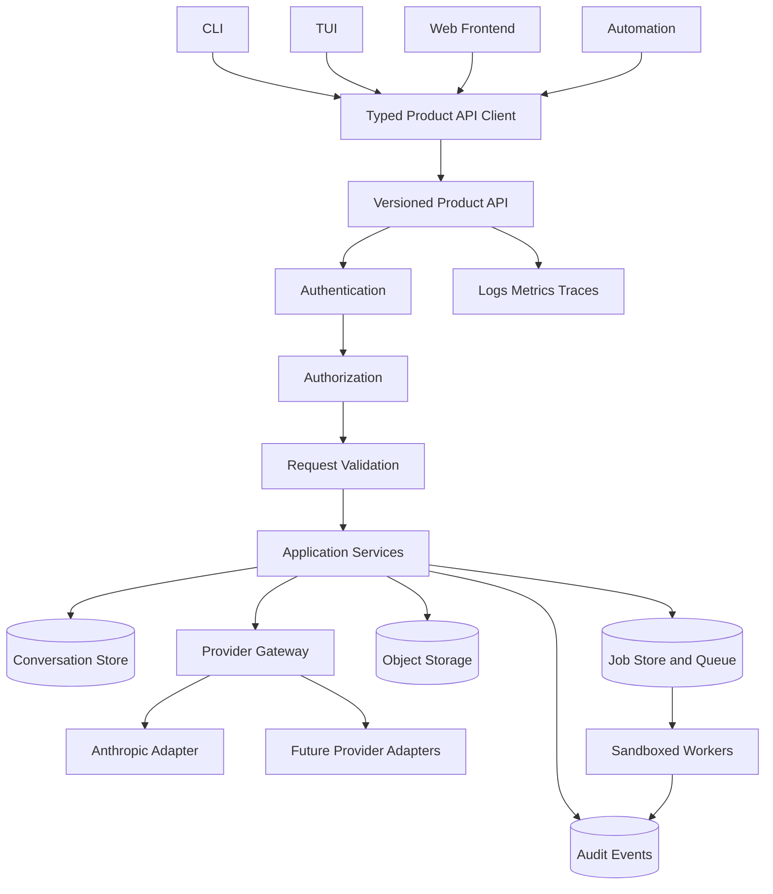

# ZAI Coder Production Migration Execution Plan

> Dependency-ordered implementation plan for migrating ZAI Coder from a provider-coupled local CLI into a production-grade product platform.

**Status:** Active  
**Last updated:** 2026-07-15  
**Target branch:** `main` through reviewed pull requests  
**Strategic source:** [`../../ROADMAP.md`](../../ROADMAP.md)

---

## 1. Operating Rules

This plan is the technical source of truth for implementation order, acceptance criteria, evidence, and rollback requirements.

### 1.1 Completion policy

A phase or vertical slice is complete only when:

1. production code is connected end-to-end;
2. relevant failure and adversarial paths are tested;
3. formatting, lint, type checking, focused tests, and affected integration tests pass;
4. API schemas and documentation match runtime behavior;
5. security and compatibility impacts are recorded;
6. no newly introduced failures remain;
7. command output or CI evidence is attached to the pull request or validation record.

A module, flag, route, mock, document, or test name is not evidence of a complete feature by itself.

### 1.2 Branch and review policy

- Work in dependency-scoped branches.
- Do not push implementation directly to `main`.
- Keep vertical slices reviewable.
- Prefer one architectural outcome per pull request.
- Never combine destructive migrations with unrelated refactors.
- Require explicit review for auth, authorization, secrets, filesystem, shell, migration, and deployment changes.

### 1.3 Change protocol

For each changed file:

1. read the complete relevant implementation;
2. trace callers, imports, schemas, persistence, and tests;
3. make the smallest complete change;
4. add or update tests immediately;
5. run the smallest relevant validation;
6. record compatibility and security effects;
7. update this plan when status or sequencing changes.

---

## 2. Target Architecture



### 2.1 Canonical request path

```text
Client command
-> typed API client
-> versioned route
-> authentication
-> authorization
-> validation
-> application service
-> repository / provider / worker adapter
-> persistence transaction
-> audit and telemetry
-> typed response or terminal stream event
```

### 2.2 Trust boundaries

- Client devices are untrusted.
- Browser and CLI clients never receive provider secrets.
- Product API authenticates and authorizes all protected operations.
- Provider adapters are server-only.
- Workers use scoped, short-lived grants.
- Uploaded content and model-generated tool input are untrusted.
- Audit and observability pipelines must redact secrets and sensitive content.

---

## 3. Current Baseline

### 3.1 Verified repository facts

- Current `main.py` on `main` reports version `1.22.0`.
- Existing roadmap metadata had drifted from source state.
- The project has a broad direct-provider CLI surface.
- Provider-specific imports and credential loading remain in client-facing modules.
- A lightweight web backend exists but is not yet the canonical product API.
- TUI streaming reliability has been addressed as an isolated slice.
- A complete `docs/migration/execution-plan.md` did not previously exist.

### 3.2 Baseline validation to capture before implementation

Run and record exact output for the current branch:

```bash
python -m compileall -q .
python -m ruff check .
python -m black --check .
python -m mypy .
python -m pytest -ra
python -m pytest --collect-only -q
python -m build
```

Where dependencies or environment services are unavailable, record the precise missing prerequisite; do not report the check as passing.

### 3.3 Required baseline artifacts

Create and maintain:

- `docs/implementation/repository-assessment.md`
- `docs/implementation/dependency-map.md`
- `docs/implementation/feature-matrix.md`
- `docs/implementation/api-gap-analysis.md`
- `docs/implementation/security-audit.md`
- `docs/implementation/test-coverage-map.md`
- `docs/implementation/file-implementation-plan.md`
- `docs/implementation/change-log.md`
- `docs/implementation/final-validation.md`

---

## 4. Architectural Invariants

Continuously verify these invariants:

1. CLI and browser code import no provider SDK.
2. CLI and browser configuration contains no provider credential.
3. All user-facing clients use one canonical typed product API client.
4. API routes perform minimal transport orchestration.
5. Business logic resides in application services.
6. Provider-specific code remains behind adapters.
7. Persistence remains behind repository or data-access boundaries.
8. Every tenant-owned record is scoped by actor, organization, and workspace where applicable.
9. Every mutating operation is authorized and audited.
10. Every stream reaches exactly one terminal event.
11. Cancellation propagates through every active layer.
12. Retried operations do not create duplicate side effects.
13. Errors are typed and preserve request/correlation IDs.
14. Secrets are redacted from logs, errors, traces, metrics, and audit events.
15. OpenAPI and runtime contracts match.
16. Dangerous tools default to denied.
17. Filesystem and network access is contained by enforceable policy, not documentation alone.
18. Production behavior is never implemented only in tests or mocks.

---

# Phase 0 — Repository Baseline and Drift Control

**Status:** In progress  
**Priority:** P0

## Objectives

- Establish a reproducible baseline.
- Replace stale manual inventories with generated or verifiable records.
- Classify architecture, security, testing, and documentation gaps.

## Tasks

1. Inventory files, languages, dependencies, package managers, entry points, routes, and workflows.
2. Build an import/dependency map for CLI, TUI, web, provider modules, persistence, and security utilities.
3. Trace every CLI command to its final execution path.
4. Identify direct provider SDK imports and provider credential reads.
5. Search for TODO, FIXME, HACK, `NotImplemented`, placeholder, stub, mock-only, disabled-test, broad-ignore, hard-coded URL, and credential patterns.
6. Compare documented feature claims against production paths.
7. Record baseline commands and failures.
8. Add CI checks for source-version and documentation-version drift.
9. Add a generated inventory command or script.

## Deliverables

- Repository assessment.
- Dependency map.
- Feature matrix.
- API gap analysis.
- Security audit with evidence and severity.
- Parametrize-aware test inventory.
- File-by-file implementation plan.

## Acceptance criteria

- Every CLI entry point has a documented execution path.
- Every provider import and credential read is classified.
- Every sensitive filesystem, shell, URL, and upload path is identified.
- Baseline validation results are reproducible.
- Documentation no longer claims unsupported completion.

## Rollback

Documentation and analysis only; revert generated artifacts or CI drift checks if they block valid release flows, then fix the generator rather than suppressing the problem.

---

# Phase 1 — TUI Streaming Reliability

**Status:** Verified complete for isolated reliability slice  
**Priority:** Completed

## Delivered behavior

- Immediate first-delta render.
- Bounded render cadence.
- Size-threshold flushing.
- Unconditional final partial-response flush.
- Deterministic framework-independent tests.
- Partial-content preservation on stream failure.

## Remaining migration work

This phase does not satisfy product-API mediation. The TUI must later consume the canonical product stream rather than a provider SDK.

## Regression gate

- Final visible output equals persisted output.
- No duplicate terminal render.
- Short and fast streams flush correctly.
- Stream errors do not leave the input permanently disabled.

---

# Phase 2 — Shared Domain Models and Error Contract

**Status:** Planned  
**Priority:** P0

## Objectives

Create provider-neutral types used by API routes, application services, clients, persistence, and provider adapters.

## Proposed structure

```text
zaicoder/
  domain/
    models.py
    messages.py
    content.py
    tools.py
    usage.py
    streams.py
    jobs.py
    approvals.py
    errors.py
```

The exact package layout may adapt to repository packaging conventions, but only one canonical definition may exist for each type.

## Required domain types

- Model descriptor and capabilities.
- Conversation and message identifiers.
- Text, image, document, tool-use, and tool-result content blocks.
- Usage and cost metadata.
- Stop reasons.
- Stream events.
- Product error envelope.
- Job and approval states.
- Pagination cursor/page metadata.

## Typed error envelope

```json
{
  "error": {
    "code": "string",
    "message": "string",
    "request_id": "string",
    "correlation_id": "string",
    "retryable": false,
    "details": {}
  }
}
```

## Stream event vocabulary

- `stream.started`
- `message.started`
- `content.delta`
- `tool.started`
- `tool.input.delta`
- `tool.completed`
- `usage.updated`
- `message.completed`
- `stream.completed`
- `stream.failed`
- `stream.cancelled`
- `heartbeat`

## Tests

- Serialization/deserialization.
- Unknown field behavior.
- Backward-compatible additions.
- Invalid state transitions.
- Error redaction.
- Exactly-one-terminal-event validation.

## Acceptance criteria

- Application services depend only on domain types.
- Provider SDK types do not leak through public API schemas.
- Client and server share generated or synchronized contract types.

---

# Phase 3 — Canonical Typed Product API Client

**Status:** Next active vertical slice  
**Priority:** P0

## Objectives

Build one client used by CLI, TUI, browser-facing integration layers, tests, and automation.

## Proposed structure

```text
zaicoder/
  client/
    __init__.py
    config.py
    auth.py
    transport.py
    retries.py
    streaming.py
    uploads.py
    pagination.py
    errors.py
    models.py
```

## Required capabilities

- Product base URL.
- API-version negotiation.
- Product access token.
- Refresh-once behavior.
- Request and correlation IDs.
- Idempotency keys.
- Timeout configuration.
- Bounded exponential backoff with jitter.
- Retry classification.
- Pagination.
- Multipart and streaming uploads.
- Streaming parsing and cancellation.
- User-agent and client-version metadata.
- Typed errors.
- Debug logging with redaction.

## Retry policy

Retry only when safe:

- transient connection errors;
- retryable gateway errors;
- rate limits honoring `Retry-After`;
- idempotent methods;
- non-idempotent methods carrying an accepted idempotency key.

Never automatically retry:

- authentication failure;
- authorization failure;
- validation failure;
- explicit user cancellation;
- non-idempotent request without idempotency protection.

## Streaming parser requirements

- Partial network frames.
- Multiple events in one frame.
- UTF-8 split boundaries.
- Event ordering.
- Heartbeats.
- Malformed event errors.
- Provider/API error events.
- Resource closure.
- User cancellation.
- Exactly one terminal event.

## Tests

- Authentication header and refresh.
- Refresh only once per failed request.
- Request/correlation propagation.
- Retry classification and backoff bounds.
- Idempotency behavior.
- Timeout and cancellation.
- Streaming frame fragmentation.
- Multiple events per chunk.
- Malformed payload.
- Upload progress and error handling.
- Secret redaction.

## Acceptance criteria

- New client foundation has no provider SDK dependency.
- No CLI command implements duplicate raw HTTP transport after migration.
- Deterministic tests require no live provider credential.

---

# Phase 4 — Versioned Product API Foundation

**Status:** Planned  
**Priority:** P0

## Objectives

Create a stable server boundary with minimal routes and explicit dependency injection.

## Initial routes

```text
GET  /v1/health
GET  /v1/health/live
GET  /v1/health/ready
GET  /v1/version
GET  /v1/models
GET  /v1/models/{model_id}
POST /v1/auth/login
POST /v1/auth/refresh
POST /v1/auth/logout
GET  /v1/auth/sessions
```

## Cross-cutting middleware

- Request ID.
- Correlation ID.
- Structured access logging.
- Error normalization.
- CORS policy.
- Rate limiting boundary.
- Authentication.
- API-version reporting.
- Response timing metrics.

## Health semantics

- Liveness verifies the process can respond.
- Readiness verifies configured critical dependencies.
- Provider status must not expose credentials or raw provider errors.

## OpenAPI

- Runtime schemas are the contract source.
- CI exports and diffs OpenAPI.
- Breaking changes require explicit approval.
- Typed clients are generated or checked against the contract.

## Tests

- Route contract tests.
- Error envelope tests.
- Header propagation.
- CORS behavior.
- Rate-limit metadata.
- Health dependency states.
- OpenAPI drift.

## Acceptance criteria

- Typed client can call health, version, and model catalog.
- CLI health and model listing no longer require provider credentials.

---

# Phase 5 — Provider Gateway and Anthropic Adapter

**Status:** Planned  
**Priority:** P0

## Objectives

Move provider-specific behavior behind a server-only adapter.

## Interfaces

```text
ProviderGateway
  list_models()
  get_model()
  create_message()
  stream_message()
  count_tokens()
  upload_file()
  cancel_operation()
```

## Anthropic adapter responsibilities

- Server-side credential loading.
- Domain-to-provider request conversion.
- Provider-to-domain response conversion.
- Streaming event normalization.
- Tool call/result conversion.
- Usage and stop-reason conversion.
- Provider error normalization.
- Timeout and cancellation propagation.
- Capability negotiation.
- Rate-limit metadata.

## Rules

- Never silently drop unsupported fields.
- Return typed capability errors.
- Do not expose provider exception text without redaction.
- Centralize provider retry behavior; avoid retrying at both client and adapter layers without coordination.

## Tests

- Request mapping.
- Response mapping.
- Streaming mapping.
- Tool blocks.
- Usage and stop reasons.
- Capability errors.
- Rate limits and retry metadata.
- Redacted provider errors.
- Cancellation.

## Acceptance criteria

- Provider SDK imports are confined to adapter/infrastructure packages.
- Application services and client packages import no provider SDK.

---

# Phase 6 — Core Messages and Conversations

**Status:** Planned  
**Priority:** P0

## API routes

```text
POST   /v1/conversations
GET    /v1/conversations
GET    /v1/conversations/{conversation_id}
DELETE /v1/conversations/{conversation_id}
POST   /v1/conversations/{conversation_id}/messages
GET    /v1/conversations/{conversation_id}/messages
POST   /v1/conversations/{conversation_id}/messages:stream
POST   /v1/conversations/{conversation_id}:cancel
```

## Persistence model

- Conversation.
- Message.
- Content block.
- Attachment reference.
- Usage.
- Model metadata.
- Stream/operation state.
- Ownership scope.
- Created/updated/deleted timestamps.

## Message states

- pending;
- streaming;
- completed;
- failed;
- cancelling;
- cancelled.

## Requirements

- Transactional message creation.
- Optimistic concurrency where needed.
- Partial-state persistence.
- Exactly one terminal state.
- Safe resume behavior after disconnect.
- Authorization by ownership scope.
- Idempotency for message submission.

## Tests

- Conversation CRUD.
- Ownership isolation.
- Duplicate idempotency key.
- Streaming disconnect and reconnect.
- Cancellation races.
- Provider failure after partial output.
- Persistence failure and rollback.
- Application restart recovery.

## Acceptance criteria

- Non-streaming and streaming chat work through product API.
- Persisted final output equals client-visible final output.

---

# Phase 7 — CLI and TUI Chat Migration

**Status:** Planned  
**Priority:** P0

## Migration order

1. Health and version.
2. Model catalog.
3. Single prompt.
4. Interactive chat.
5. TUI streaming.
6. Conversation list/resume/delete.
7. Output formats.
8. Cancellation and exit codes.

## CLI configuration

Allowed client configuration:

- product API URL;
- product access/refresh credentials through secure storage;
- organization/workspace selection;
- timeout and output preferences;
- TLS and proxy settings where approved.

Disallowed client configuration:

- provider API key;
- provider endpoint credentials;
- server-only secrets.

## Compatibility

- Deprecate direct-provider flags with clear warnings.
- Define a transition window.
- Do not silently reinterpret provider credentials as product credentials.
- Provide migration commands or documentation.

## Tests

- CLI command snapshots.
- Exit codes.
- JSON/plain/markdown output.
- Auth expiry and refresh.
- Network timeout.
- Ctrl+C cancellation.
- Stream terminal behavior.
- No provider SDK import in client package.
- No provider secret read in active client paths.

## Acceptance criteria

- Prompt and interactive chat require only product credentials.
- TUI consumes product stream events.
- Direct provider paths are removed or explicitly deprecated and disabled by default.

---

# Phase 8 — Product Authentication and Authorization

**Status:** Planned  
**Priority:** P0

## Authentication

- Login.
- Access token.
- Rotating refresh token.
- Logout/revocation.
- Session inventory.
- Secure CLI credential storage.
- Expiry and clock-skew handling.

## Authorization

- Actor identity.
- Organization membership.
- Workspace membership.
- Roles or policy grants.
- Resource ownership.
- Explicit permission checks at service boundaries.

## Required adversarial tests

- Expired token.
- Invalid signature.
- Revoked refresh token.
- Reused rotated refresh token.
- Wrong organization.
- Wrong workspace.
- Missing role.
- Cross-tenant identifier guessing.
- Authorization bypass through list/filter routes.
- Audit event on denied mutation.

## Acceptance criteria

- Every protected route authenticates.
- Every mutation authorizes.
- Tenant isolation tests pass.
- Tokens and secrets are redacted.

---

# Phase 9 — Secure Files and Attachments

**Status:** Planned  
**Priority:** P1

## API routes

```text
POST   /v1/files
GET    /v1/files/{file_id}
GET    /v1/files/{file_id}/content
DELETE /v1/files/{file_id}
POST   /v1/conversations/{conversation_id}/attachments
```

## Requirements

- Multipart and streaming upload.
- Central file-size configuration.
- MIME and extension validation.
- Sanitized names.
- Content hash.
- Authorized object storage.
- Signed downloads where needed.
- Extraction boundaries for text, image, PDF, and document formats.
- Malware scanner adapter boundary.
- Retention and cleanup.

## Filesystem security

- Canonical path containment.
- Symlink handling.
- No user-controlled path used directly for recursive deletion.
- No absolute or traversal path acceptance outside approved roots.
- Race-resistant create/delete behavior.

## Tests

- Oversized upload.
- Invalid MIME.
- Extension/content mismatch.
- Malicious filename.
- Traversal path.
- Symlink escape.
- Unauthorized download/delete.
- Duplicate hash.
- Storage failure and cleanup.

## Acceptance criteria

- One canonical validator controls all upload paths.
- No client sends provider file credentials.
- Attachments are scoped and auditable.

---

# Phase 10 — Tool Registry, Grants, and Approval State Machine

**Status:** Planned  
**Priority:** P0

## Tool execution prerequisites

A tool may run only when:

- it exists in the registry;
- input validates against its schema;
- the actor is authenticated and authorized;
- the workspace permits it;
- required grants exist;
- required approval is approved and unexpired;
- execution policy permits the operation;
- resource limits are configured.

## Approval states

- not_required;
- pending;
- approved;
- denied;
- expired;
- consumed;
- cancelled.

## Tool policy classes

- read-only;
- file mutation;
- shell/process;
- network;
- external service mutation;
- administrative/destructive.

## Required audit record

- actor;
- organization;
- workspace;
- conversation/job;
- tool;
- normalized input hash;
- grant and approval identity;
- start/end timestamps;
- result status;
- resource usage;
- redacted error;
- request/correlation/trace IDs.

## Tests

- Missing tool.
- Invalid schema.
- Missing grant.
- Pending, denied, stale, expired, and consumed approval.
- Permission-mode semantics.
- Duplicate execution.
- Policy update during pending approval.
- Secret in tool input/output.

## Acceptance criteria

- Permission modes have explicit tested semantics.
- `acceptEdits` cannot implicitly authorize shell or unrelated mutations.
- Dangerous tools are denied by default.

---

# Phase 11 — Sandboxed Workers and Durable Jobs

**Status:** Planned  
**Priority:** P1

## Job states

- queued;
- awaiting_approval;
- approved;
- running;
- cancelling;
- cancelled;
- retrying;
- succeeded;
- failed;
- expired.

Only documented transitions are valid.

## Worker requirements

- Non-root execution.
- CPU, memory, process, disk, output, and duration limits.
- Scoped filesystem.
- Network deny-by-default or explicit allow policy.
- Scoped short-lived credentials.
- Cancellation.
- Structured stdout/stderr capture.
- Heartbeats and orphan detection.
- Cleanup after termination.

## Queue requirements

- Durable submission.
- Idempotency.
- Visibility/lease semantics.
- Retry classification.
- Dead-letter handling.
- Recovery after worker/API restart.

## Tests

- Duplicate submission.
- Queue outage.
- Worker crash.
- Lease expiry.
- Cancellation race.
- Retryable/non-retryable failures.
- Resource limit termination.
- Network/filesystem policy denial.
- Application restart.

## Acceptance criteria

- Jobs survive process restart.
- Duplicate submissions do not duplicate side effects.
- Cancellation reaches the worker and durable state.
- Every execution emits audit and observability data.

---

# Phase 12 — Web Frontend Migration

**Status:** Planned  
**Priority:** P1

## Architecture

- Browser uses product API only.
- Generated/shared contract types.
- Central fetch/stream wrapper.
- No provider secret in HTML, JavaScript, local storage, logs, or network requests.

## Security

- Content Security Policy.
- Safe markdown/content rendering.
- No unsafe HTML injection.
- CSRF protection for cookie-based sessions.
- Secure cookie attributes where used.
- Token storage strategy documented.
- Upload validation.
- Dependency audit.

## UX requirements

- Login/logout and session expiry.
- Organization/workspace selection.
- Model catalog.
- Conversations.
- Streaming output.
- Cancellation and reconnect.
- File upload progress.
- Tool approval interface.
- Job status and logs.
- Accessible error and loading states.

## Tests

- Component tests.
- API mocking at contract boundary.
- XSS payloads.
- Auth expiry.
- Stream fragmentation/reconnect.
- Upload failures.
- Approval state transitions.
- Browser E2E.
- Accessibility checks.

## Acceptance criteria

- Browser and CLI show equivalent product semantics.
- No provider credential reaches the browser.
- Frontend security tests pass.

---

# Phase 13 — Usage, Audit, and Observability

**Status:** Planned  
**Priority:** P1

## Usage

- Input/output tokens.
- Thinking tokens where available.
- Model and provider.
- Conversation, actor, organization, workspace.
- Request/job identity.
- Cost metadata where configured.

## Observability

- Structured logs.
- Metrics.
- Distributed traces.
- Correlated request, conversation, operation, and job IDs.
- Provider latency.
- Queue depth and worker health.
- Active streams and cancellations.
- Retry and rate-limit counts.

## Audit

- Authentication events.
- Authorization decisions.
- Configuration and policy changes.
- File access and deletion.
- Tool grants, approvals, and executions.
- Job lifecycle.
- Administrative actions.

## Redaction

- API keys and tokens.
- Authorization headers.
- Credential-like environment variables.
- Provider errors containing request content or secrets.
- Sensitive tool input/output according to policy.

## Tests

- Correlation propagation.
- Audit completeness.
- Redaction patterns.
- Metric cardinality bounds.
- Trace spans for error/cancellation paths.

## Acceptance criteria

- A request can be followed across client, API, provider, persistence, queue, and worker.
- Audit records contain no provider secrets.

---

# Phase 14 — CI, Packaging, and Supply Chain

**Status:** Planned  
**Priority:** P0

## Required CI jobs

1. dependency installation from lock/constraint files;
2. formatting;
3. lint;
4. type checking;
5. unit tests;
6. contract tests;
7. integration tests;
8. security tests;
9. frontend tests;
10. E2E tests;
11. OpenAPI drift;
12. database migration validation;
13. package build;
14. Windows/Linux executable build;
15. frontend production build;
16. container build and scan;
17. startup and health smoke tests;
18. secret scan;
19. dependency/provenance scan;
20. documentation drift checks.

## Supply-chain controls

- Pin build actions and critical dependencies.
- Generate SBOMs.
- Sign release artifacts where supported.
- Record provenance.
- Restrict workflow token permissions.
- Protect release environments.
- Separate pull-request checks from deployment credentials.

## Acceptance criteria

- Clean checkout reproduces all release artifacts.
- CI does not need a live provider key except explicit gated smoke tests.
- Release artifacts include checksums, version metadata, SBOM, and provenance.

---

# Phase 15 — Production Deployment and Operations

**Status:** Planned  
**Priority:** P1

## Runtime topology

- Product API.
- Database.
- Queue.
- Sandboxed workers.
- Object storage.
- Observability pipeline.
- Identity provider integration.
- Managed secret store.

## Container requirements

- Minimal image.
- Non-root user.
- Read-only root filesystem where practical.
- Dropped capabilities.
- Resource requests/limits.
- Health probes.
- Graceful shutdown and draining.
- No embedded secrets.

## Operational procedures

- Environment schema and validation.
- Database migration.
- Backup and restore.
- Rollback.
- Secret rotation.
- Provider outage response.
- Queue backlog response.
- Worker compromise response.
- Incident audit export.

## Acceptance criteria

- Deployment smoke test succeeds in a clean environment.
- Backup/restore is verified.
- Upgrade and rollback are rehearsed.
- Readiness reflects actual dependency availability.

---

# Phase 16 — Final Repository-Wide Validation

**Status:** Planned  
**Priority:** Release gate

Run from a clean checkout:

1. clean dependency installation;
2. formatting check;
3. lint;
4. type checking;
5. unit tests;
6. integration tests;
7. API contract tests;
8. frontend tests;
9. E2E tests;
10. security/adversarial tests;
11. OpenAPI drift check;
12. database migration from empty;
13. upgrade from each supported previous version;
14. CLI build;
15. server build;
16. frontend production build;
17. Windows/Linux packaging;
18. container build and scan;
19. container startup;
20. liveness/readiness checks;
21. CLI-to-API prompt smoke test;
22. streaming/cancellation smoke test;
23. file upload/download smoke test;
24. tool approval and denial smoke test;
25. job retry/recovery/cancellation smoke test;
26. secret scan;
27. dependency/provenance scan;
28. documentation/version drift check.

## Final source inspection

Search for and resolve material instances of:

- provider imports in client/browser packages;
- provider credentials outside server secret configuration;
- TODO, FIXME, HACK, `NotImplemented`, placeholder, or stub production paths;
- disabled tests;
- broad lint/type suppressions;
- hard-coded localhost or provider URLs in active clients;
- hard-coded credentials;
- unsafe shell execution;
- uncontained filesystem operations;
- unscoped persistence queries;
- missing authorization;
- secret logging;
- duplicated transport, retry, auth, or validation logic.

## Release acceptance

Release is blocked when any mandatory validation fails. Do not weaken assertions, suppress checks, or remove security controls solely to produce a green build.

---

## 17. Vertical Slice Template

Use this template for every implementation PR.

```markdown
# Slice: <name>

## User outcome

## Current path

## Target path

## Files traced

## Contracts changed

## Security and ownership rules

## Failure, retry, timeout, and cancellation behavior

## Implementation changes

## Tests added or updated

## Commands executed and exact results

## Compatibility impact

## Migration and rollback

## Remaining work
```

---

## 18. Adversarial Review Checklist

Apply relevant cases before closing each slice:

- expired, invalid, or revoked token;
- wrong organization/workspace;
- missing permission;
- malformed request;
- unsupported model/capability;
- provider unavailable or rate-limited;
- network timeout;
- fragmented/disconnected stream;
- user cancellation;
- duplicate request/job;
- stale, denied, or expired approval;
- oversized or malicious file;
- invalid MIME/extension;
- path traversal or symlink escape;
- command injection;
- SSRF;
- secret in provider/tool error;
- partial database failure;
- queue failure;
- worker crash;
- application restart;
- audit/telemetry pipeline failure.

---

## 19. Status Summary

### Verified complete

- Repository roadmap replaced with a current production-platform strategy.
- TUI streaming reliability slice.

### Next implementation slice

- Shared domain types and typed error contract.
- Canonical product API client foundation.
- Product API health/version/model endpoints.

### Critical path

```text
Domain contracts
-> typed product API client
-> versioned product API
-> provider adapter
-> chat/conversation service
-> CLI/TUI migration
-> auth and ownership
-> files/tools/jobs
-> frontend
-> observability and deployment
```

### Production readiness

Not yet achieved. The repository remains in migration from a direct-provider local-tool architecture to a product-API platform architecture.
